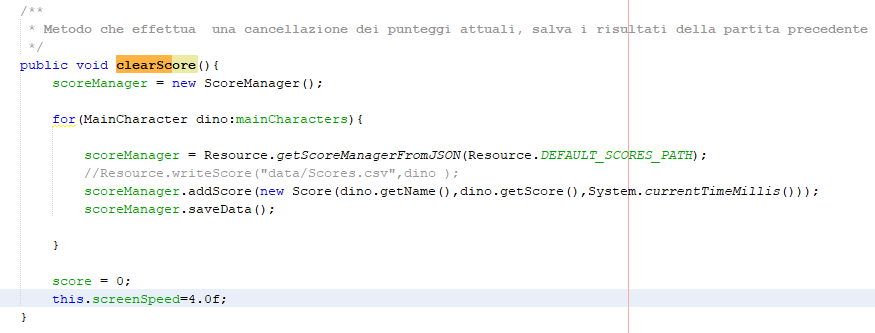

# ChromeDinoHotseat | Diario di lavoro
##### Michele Tomyslak
### Trevano, 10.12.2020

## Lavori svolti

|Orario        |Lavoro svolto                 |
|--------------|------------------------------|
|12:30 - 14:00   | Cominciando a costruire la documentazione, raccolta commenti dal codice e immagini dei design e della progettazione|
|14:15 - 15:45| Risolto dei bug nel salvataggio e caricamento dei dati, implementando in maniera diversa il metodo saveData, dove al posto di salvare direttamente l'oggetto alla fine del ciclo di clearScore, ho deciso di scrivere i dati direttamente mentre sta passando il ciclo dei MainCharacter, così da non poter visualizzare solo il primo o l'ultimo valore. Aggiunti altri commenti al codice mancante.
 |

##  Problemi riscontrati e soluzioni adottate
	
	
	
	

##  Punto della situazione rispetto alla pianificazione
	Tecnicamente rispetto alla pianificazione sono quasi a pari pari, tranne che per la documentazione, dove credo di essere ancora un po' indietro rispetto al previsto.

## Programma di massima per la prossima giornata di lavoro
	
	Completare la documentazione, ripulitura definitiva del codice e compilazione della javadoc e del jar eseguibile. README.md e consegna completa del progetto entro il 17.12.2020.