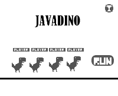
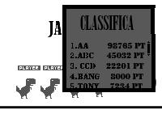
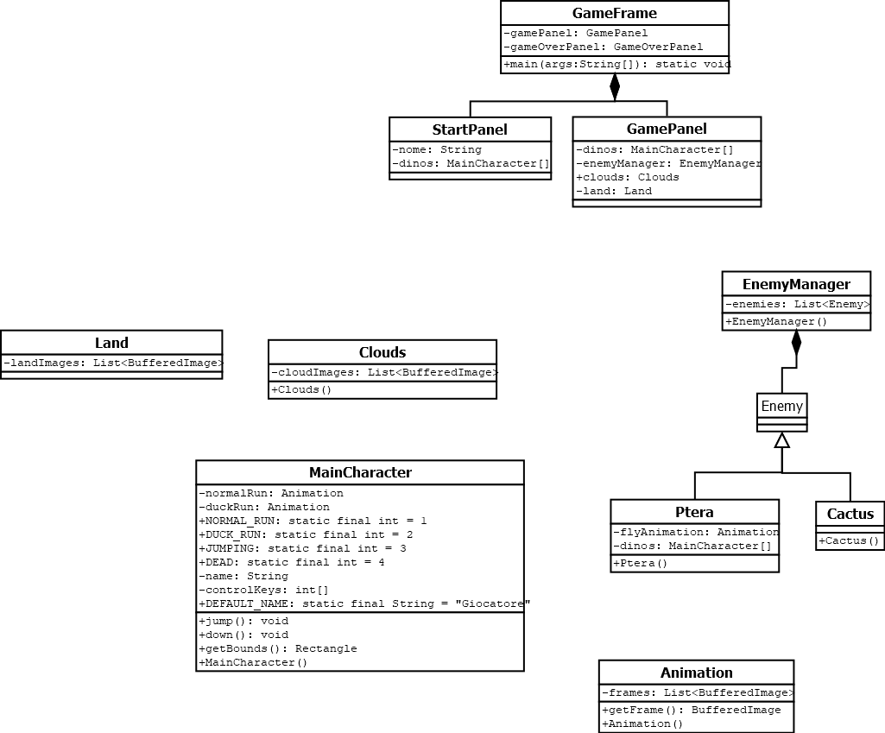

1. [Introduzione](#introduzione)

  - [Informazioni sul progetto](#informazioni-sul-progetto)

  - [Abstract](#abstract)

  - [Scopo](#scopo)

1. [Analisi](#analisi)

  - [Analisi del dominio](#analisi-del-dominio)
  
  - [Analisi dei mezzi](#analisi-dei-mezzi)

  - [Analisi e specifica dei requisiti](#analisi-e-specifica-dei-requisiti)

  - [Use case](#use-case)

  - [Pianificazione](#pianificazione)

1. [Progettazione](#progettazione)

  - [Design dell’architettura del sistema](#design-dell’architettura-del-sistema)

  - [Design dei dati e database](#design-dei-dati-e-database)

1. [Implementazione](#implementazione)

1. [Test](#test)

  - [Protocollo di test](#protocollo-di-test)

  - [Risultati test](#risultati-test)

  - [Mancanze/limitazioni conosciute](#mancanze/limitazioni-conosciute)

1. [Consuntivo](#consuntivo)

1. [Conclusioni](#conclusioni)

  - [Sviluppi futuri](#sviluppi-futuri)

  - [Considerazioni personali](#considerazioni-personali)

1. [Sitografia](#sitografia)

1. [Allegati](#allegati)

## Introduzione

### Informazioni sul progetto

  

  - Allievo: Michele Tomyslak
  - Docente supervisore : Geo Petrini
  - Scuola: Scuola d'arti e mestieri Trevano
  - Sezione: Informatica
  - Materia: Modulo 306
  - Data di inizio: 03.09.2020
  - Data di fine: 17.12.2020
     

### Abstract

  E’ una breve e accurata rappresentazione dei contenuti di un documento,
  senza notazioni critiche o valutazioni. Lo scopo di un abstract efficace
  dovrebbe essere quello di far conoscere all’utente il contenuto di base
  di un documento e metterlo nella condizione di decidere se risponde ai
  suoi interessi e se è opportuno il ricorso al documento originale.

  Può contenere alcuni o tutti gli elementi seguenti:

  -   **Background/Situazione iniziale**
      

  -   **Descrizione del problema e motivazione**

      Hai mai pensato di voler giocare al famoso dinosauro di google con i tuoi amici? Peccato che non sia possibile.

      

  -   **Approccio/Metodi**
      Con la mia applicazione in Java ho cercato di risolvere il dilemma del multigiocatore, ricreando il gioco direttamente da zero, tramite componenti Swing e la gestione della tastiera.

    : Come ho ottenuto dei progressi? Come ho
      risolto il problema (tecniche…)? Quale è stata l’entità del mio
      lavoro? Che fattori importanti controllo, ignoro o misuro?

  -   **Risultati**: Quale è la risposta? Quali sono i risultati? Quanto è
      più veloce, più sicuro, più economico o in qualche altro aspetto
      migliore di altri prodotti/soluzioni?

  Esempio di abstract:

  > *As the size and complexity of today’s most modern computer chips
  > increase, new techniques must be developed to effectively design and
  > create Very Large Scale Integration chips quickly. For this project, a
  > new type of hardware compiler is created. This hardware compiler will
  > read a C++ program, and physically design a suitable microprocessor
  > intended for running that specific program. With this new and powerful
  > compiler, it is possible to design anything from a small adder, to a
  > microprocessor with millions of transistors. Designing new computer
  > chips, such as the Pentium 4, can require dozens of engineers and
  > months of time. With the help of this compiler, a single person could
  > design such a large-scale microprocessor in just weeks.*

### Scopo

Lo scopo è puramente a scopo didattico, anche se valutato dal supervisore.

## Analisi

### Analisi del dominio

  Questo capitolo dovrebbe descrivere il contesto in cui il prodotto verrà
  utilizzato, da questa analisi dovrebbero scaturire le risposte a quesiti
  quali ad esempio:

  -   Background/Situazione iniziale

  -   Quale è e come è organizzato il contesto in cui il prodotto dovrà
      funzionare?

  -   Come viene risolto attualmente il problema? Esiste già un prodotto
      simile?

  -   Chi sono gli utenti? Che bisogni hanno? Come e dove lavorano?

  -   Che competenze/conoscenze/cultura posseggono gli utenti in relazione
      con il problema?

  -   Esistono convenzioni/standard applicati nel dominio?

  -   Che conoscenze teoriche bisogna avere/acquisire per poter operare
      efficacemente nel dominio?

  -   …

### Analisi e specifica dei requisiti

  L’obiettivo del progetto è lo sviluppo di una versione hotseat del gioco Chrome Dino.
Il gioco di base è questo https://chromedino.com/ ma pensato per più giocatori in contemporanea.

  |**ID**	|**Nome**			|**Priorità**|**Vers**|**Note**  |
  |----|------------|--------|----|------|
  |Req-1|Il gioco dovrà essere standalone|1|1.0||
  |Req-2|Deve esserci la possibilità di giocare fino a  4 giocatori|1|1.0|...|
  |Req-3|Il gioco deve essere in grado di mantenere salvati gli highscore degli ultimi 20 migliori risultati|1|1.0|...|
|Req-4|Deve esserci la possibilità di resettare la classifica dei risultati|1|1.0|...|
|Req-5|Devono esserci due livelli di parallasse|1|1.0|...|
|Req-6|La generazione del terreno deve essere infinita|1|1.0|...|
|Req-7|Il dinosauro di ogni giocatore deve essere visibile a schermo|1|1.0|...|  
|Req-8|Deve essere possibile usare come controller sia il mouse che la tastiera, ed eventualmente un controller esterno|1|1.0|...|
|Req-9|Tutti i giocatori devono poter giocare contemporaneamente sullo stesso pc|1|1.0|...|
|Req-10|Deve esserci la possibilità di inserire il proprio nome nel gioco|1|1.0|...|
|Req-11|Deve essere possibile personalizzare il proprio dinosauro (Colore,forma)|1|1.0|...|
  

### Use case

I casi d’uso rappresentano l’interazione tra i vari attori e le
funzionalità del prodotto.

### Pianificazione

<object data="ganttpreventivo.pdf" type="application/pdf" width="700px" height="700px">
    <embed src="http://yoursite.com/the.pdf">
        
This browser does not support PDFs. Please download the PDF to view it: <a href="http://yoursite.com/the.pdf">Download PDF</a>.

    </embed>
</object>
Prima di stabilire una pianificazione bisogna avere almeno una vaga idea
del modello di sviluppo che si intende adottare. In questa sezione
bisognerà inserire il modello concettuale di sviluppo che si seguirà
durante il progetto. Gli elementi di riferimento per una buona
pianificazione derivano da una scomposizione top-down della problematica
del progetto.

La pianificazione può essere rappresentata mediante un diagramma di
Gantt.

Se si usano altri metodi di pianificazione (es scrum), dovranno apparire
in questo capitolo.

### Analisi dei mezzi

Ho ha disposizione una macchina con Windows 10 installato e Java e NetBeans 8.
Per scrivere il codice ho utilizzato NetBeans, e come librerie ho utilizzato FlexJson.
Si tratta di una libreria che permette di convertire gli oggetti Java in oggetti JSON, così da poterli memorizzare e riutilizzare più comodamente.

L'hardware deve almeno Java 8 installato, deve possedere una tastiera, mouse e un sistema operativo in grado di supportare tutto questo.

## Progettazione

Questo capitolo descrive esaustivamente come deve essere realizzato il
prodotto fin nei suoi dettagli. Una buona progettazione permette
all’esecutore di evitare fraintendimenti e imprecisioni
nell’implementazione del prodotto.

### Design dell’architettura del sistema

Descrive:

-   La struttura del programma/sistema lo schema di rete...

-   Gli oggetti/moduli/componenti che lo compongono.

-   I flussi di informazione in ingresso ed in uscita e le
    relative elaborazioni. Può utilizzare *diagrammi di flusso dei
    dati* (DFD).

-   Eventuale sitemap

### Design dei dati e database

Descrizione delle strutture di dati utilizzate dal programma in base
agli attributi e le relazioni degli oggetti in uso.

### Schema E-R, schema logico e descrizione.

Se il diagramma E-R viene modificato, sulla doc dovrà apparire l’ultima
versione, mentre le vecchie saranno sui diari.

### Design delle interfacce

Descrizione delle interfacce interne ed esterne del sistema e
dell’interfaccia utente. La progettazione delle interfacce è basata
sulle informazioni ricavate durante la fase di analisi e realizzata
tramite mockups.

### Design procedurale

Questo è il diagramma che ho scritto prima di sviluppare il codice effettivamente per il gioco.

Descrive i concetti dettagliati dell’architettura/sviluppo utilizzando
ad esempio:

-   Diagrammi di flusso e Nassi.

-   Tabelle.

-   Classi e metodi.

-   Tabelle di routing

-   Diritti di accesso a condivisioni …

Questi documenti permetteranno di rappresentare i dettagli procedurali
per la realizzazione del prodotto.

## Implementazione

In questo capitolo dovrà essere mostrato come è stato realizzato il
lavoro. Questa parte può differenziarsi dalla progettazione in quanto il
risultato ottenuto non per forza può essere come era stato progettato.

Sulla base di queste informazioni il lavoro svolto dovrà essere
riproducibile.

In questa parte è richiesto l’inserimento di codice sorgente/print
screen di maschere solamente per quei passaggi particolarmente
significativi e/o critici.

Inoltre dovranno essere descritte eventuali varianti di soluzione o
scelte di prodotti con motivazione delle scelte.

Non deve apparire nessuna forma di guida d’uso di librerie o di
componenti utilizzati. Eventualmente questa va allegata.

Per eventuali dettagli si possono inserire riferimenti ai diari.

## Test

### Protocollo di test

Definire in modo accurato tutti i test che devono essere realizzati per
garantire l’adempimento delle richieste formulate nei requisiti. I test
fungono da garanzia di qualità del prodotto. Ogni test deve essere
ripetibile alle stesse condizioni.

|Test Case      | TC-001                               |
|---------------|--------------------------------------|
|**Nome**       |Ci deve essere la possibilità di giocare fino a 4 giocatori |
|**Riferimento**|REQ-04                               |
|**Descrizione**|Deve essere possibile scegliere il numero di giocatori che giocano la partita, da 1 a 4 giocatori.|
|**Prerequisiti**|-
|**Procedura**     | Quando il gioco è nella sua fase iniziale, nella parte superiore dello schermo va premuto il tasto + o - per aggiungere o togliere giocatori dalla partita. |
|**Risultati attesi** |Il numero di giocatori aumentare quando si preme il tasto +, e con - la diminuzione del numero di giocatori fino ad un minimo di 1. |

 

|Test Case      | TC-001                               |
|---------------|--------------------------------------|
|**Nome**       |Ci deve essere la possibilità di giocare fino a 4 giocatori |
|**Riferimento**|REQ-04                               |
|**Descrizione**|Deve essere possibile scegliere il numero di giocatori che giocano la partita, da 1 a 4 giocatori.|
|**Prerequisiti**|-
|**Procedura**     | Quando il gioco è nella sua fase iniziale, nella parte superiore dello schermo va premuto il tasto + o - per aggiungere o togliere giocatori dalla partita. |
|**Risultati attesi** |Il numero di giocatori aumentare quando si preme il tasto +, e con - la diminuzione del numero di giocatori fino ad un minimo di 1. |
 

|Test Case      | TC-001                               |
|---------------|--------------------------------------|
|**Nome**       |Ci deve essere la possibilità di giocare fino a 4 giocatori |
|**Riferimento**|REQ-04                               |
|**Descrizione**|Deve essere possibile scegliere il numero di giocatori che giocano la partita, da 1 a 4 giocatori.|
|**Prerequisiti**|-
|**Procedura**     | Quando il gioco è nella sua fase iniziale, nella parte superiore dello schermo va premuto il tasto + o - per aggiungere o togliere giocatori dalla partita. |
|**Risultati attesi** |Il numero di giocatori aumentare quando si preme il tasto +, e con - la diminuzione del numero di giocatori fino ad un minimo di 1. |
 

|Test Case      | TC-001                               |
|---------------|--------------------------------------|
|**Nome**       |Ci deve essere la possibilità di giocare fino a 4 giocatori |
|**Riferimento**|REQ-04                               |
|**Descrizione**|Deve essere possibile scegliere il numero di giocatori che giocano la partita, da 1 a 4 giocatori.|
|**Prerequisiti**|-
|**Procedura**     | Quando il gioco è nella sua fase iniziale, nella parte superiore dello schermo va premuto il tasto + o - per aggiungere o togliere giocatori dalla partita. |
|**Risultati attesi** |Il numero di giocatori aumentare quando si preme il tasto +, e con - la diminuzione del numero di giocatori fino ad un minimo di 1. |
 

|Test Case      | TC-001                               |
|---------------|--------------------------------------|
|**Nome**       |Ci deve essere la possibilità di giocare fino a 4 giocatori |
|**Riferimento**|REQ-04                               |
|**Descrizione**|Deve essere possibile scegliere il numero di giocatori che giocano la partita, da 1 a 4 giocatori.|
|**Prerequisiti**|-
|**Procedura**     | Quando il gioco è nella sua fase iniziale, nella parte superiore dello schermo va premuto il tasto + o - per aggiungere o togliere giocatori dalla partita. |
|**Risultati attesi** |Il numero di giocatori aumentare quando si preme il tasto +, e con - la diminuzione del numero di giocatori fino ad un minimo di 1. |
 

|Test Case      | TC-001                               |
|---------------|--------------------------------------|
|**Nome**       |Ci deve essere la possibilità di giocare fino a 4 giocatori |
|**Riferimento**|REQ-04                               |
|**Descrizione**|Deve essere possibile scegliere il numero di giocatori che giocano la partita, da 1 a 4 giocatori.|
|**Prerequisiti**|-
|**Procedura**     | Quando il gioco è nella sua fase iniziale, nella parte superiore dello schermo va premuto il tasto + o - per aggiungere o togliere giocatori dalla partita. |
|**Risultati attesi** |Il numero di giocatori aumentare quando si preme il tasto +, e con - la diminuzione del numero di giocatori fino ad un minimo di 1. |
 

|Test Case      | TC-001                               |
|---------------|--------------------------------------|
|**Nome**       |Ci deve essere la possibilità di giocare fino a 4 giocatori |
|**Riferimento**|REQ-04                               |
|**Descrizione**|Deve essere possibile scegliere il numero di giocatori che giocano la partita, da 1 a 4 giocatori.|
|**Prerequisiti**|-
|**Procedura**     | Quando il gioco è nella sua fase iniziale, nella parte superiore dello schermo va premuto il tasto + o - per aggiungere o togliere giocatori dalla partita. |
|**Risultati attesi** |Il numero di giocatori aumentare quando si preme il tasto +, e con - la diminuzione del numero di giocatori fino ad un minimo di 1. |
 

|Test Case      | TC-001                               |
|---------------|--------------------------------------|
|**Nome**       |Ci deve essere la possibilità di giocare fino a 4 giocatori |
|**Riferimento**|REQ-04                               |
|**Descrizione**|Deve essere possibile scegliere il numero di giocatori che giocano la partita, da 1 a 4 giocatori.|
|**Prerequisiti**|-
|**Procedura**     | Quando il gioco è nella sua fase iniziale, nella parte superiore dello schermo va premuto il tasto + o - per aggiungere o togliere giocatori dalla partita. |
|**Risultati attesi** |Il numero di giocatori aumentare quando si preme il tasto +, e con - la diminuzione del numero di giocatori fino ad un minimo di 1. |

### Risultati test

Tabella riassuntiva in cui si inseriscono i test riusciti e non del
prodotto finale. Se un test non riesce e viene corretto l’errore, questo
dovrà risultare nel documento finale come riuscito (la procedura della
correzione apparirà nel diario), altrimenti dovrà essere descritto
l’errore con eventuali ipotesi di correzione.

### Mancanze/limitazioni conosciute

Ho provato a implementare dello Unit testing nel progetto, ma vista la quantità di tempo a disposizione per farlo ho preferito rinunciare .

Il gioco non è del tutto responsive,

## Consuntivo

Consuntivo del tempo di lavoro effettivo e considerazioni riguardo le
differenze rispetto alla pianificazione (cap 1.7) (ad esempio Gannt
consuntivo).

## Conclusioni

Quali sono le implicazioni della mia soluzione? Che impatto avrà?
Cambierà il mondo? È un successo importante? È solo un’aggiunta
marginale o è semplicemente servita per scoprire che questo percorso è
stato una perdita di tempo? I risultati ottenuti sono generali,
facilmente generalizzabili o sono specifici di un caso particolare? ecc

### Sviluppi futuri
  Migliorie o estensioni che possono essere sviluppate sul prodotto.

### Considerazioni personali
  Cosa ho imparato in questo progetto? ecc

## Bibliografia

### Bibliografia per articoli di riviste
1.  Cognome e nome (o iniziali) dell’autore o degli autori, o nome
    dell’organizzazione,

2.  Titolo dell’articolo (tra virgolette),

3.  Titolo della rivista (in italico),

4.  Anno e numero

5.  Pagina iniziale dell’articolo,

### Bibliografia per libri

1.  Cognome e nome (o iniziali) dell’autore o degli autori, o nome
    dell’organizzazione,

2.  Titolo del libro (in italico),

3.  ev. Numero di edizione,

4.  Nome dell’editore,

5.  Anno di pubblicazione,

6.  ISBN.

### Sitografia

1.  URL del sito (se troppo lungo solo dominio, evt completo nel
    diario),

2.  Eventuale titolo della pagina (in italico),

3.  Data di consultazione (GG-MM-AAAA).

**Esempio:**

-   http://standards.ieee.org/guides/style/section7.html, *IEEE
    Standards Style Manual*, 07-06-2008.

## Allegati

Elenco degli allegati, esempio:

-   Diari di lavoro

-   Codici sorgente/documentazione macchine virtuali

-   Istruzioni di installazione del prodotto (con credenziali
    di accesso) e/o di eventuali prodotti terzi

-   Documentazione di prodotti di terzi

-   Eventuali guide utente / Manuali di utilizzo

-   Mandato e/o Qdc

-   Prodotto

-   …
